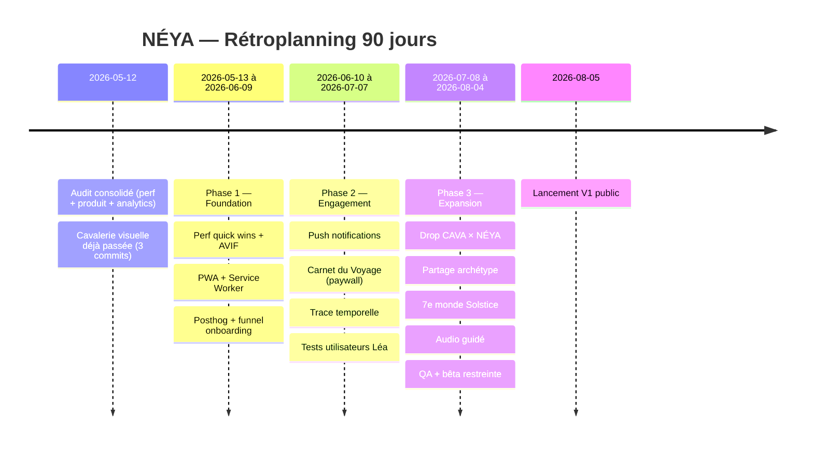

# NÉYA — Roadmap stratégique 90 jours

> **Document consolidé** suite à l'audit multi-agents du 2026-05-12 (perf · stratégie produit · analytics · UX/visuel/nav).
> Owner : Will · Production : `https://neya-kappa.vercel.app`

---

## Sommaire

1. [Résumé exécutif](#1-résumé-exécutif)
2. [État actuel](#2-état-actuel)
3. [Audit consolidé (5 axes)](#3-audit-consolidé)
4. [Backlog priorisé (RICE)](#4-backlog-priorisé)
5. [Roadmap 90 jours (S1→S12)](#5-roadmap-90-jours)
6. [Plan KPI & analytics](#6-plan-kpi--analytics)
7. [Plan de déploiement](#7-plan-de-déploiement)
8. [Risques & mitigation](#8-risques--mitigation)
9. [Critères de validation](#9-critères-de-validation)
10. [Annexes — snippets clés](#10-annexes)

---

## 1. Résumé exécutif

NÉYA est **un sanctuaire émotionnel narratif**, pas une application de méditation. Sa proposition unique tient en trois axes — esthétique cinéma vs UX clinique · présence vs performance · brand fashion (CAVA) crossover. L'audit multi-agents révèle un produit **mature côté UX et visuel** (déjà passé en revue 3× ce jour, contraste WCAG corrigé, animations riches, philosophie cohérente), mais avec **deux dettes critiques** :

1. **Performance brute** — 61 MB d'assets dans `public/`, bg-quiz-11.png à 2.8 MB, 10 PNG préchargés au boot (~13 MB), zéro Service Worker, zéro `prefers-reduced-motion`. LCP estimé 5-9s mobile 4G → zone rouge Lighthouse.
2. **Aveuglement produit** — zéro tracking, donc impossible de savoir si Léa fait son rituel, où le quiz décroche, ce que les utilisateurs vivent. Pilotage à l'aveugle.

Les **3 features manquantes** identifiées comme leviers prioritaires sont (1) PWA + push notifications poétiques, (2) Carnet écrit monétisable one-time (5-9€, respecte la philosophie non-toxique), (3) trace temporelle esthétique des passages.

**Objectif 90 jours** : passer Lighthouse en zone verte, instrumenter le funnel complet via Posthog Cloud EU, lancer la PWA installable + 1 notif/jour, livrer le Carnet écrit en one-time unlock, puis tester avec 5-8 utilisateurs cibles (persona Léa).

**North Star proposée** : `presence_sessions_per_week_per_active_user` — combine routines, quêtes, breath et EspaceVrai qualifié (>18s). Cible Q1 : ≥3.5 sessions/semaine/WAU.

---

## 2. État actuel

### Stack technique
- React 18 + Vite 5, **single-file** `src/App.jsx` (~5500 lignes, 75 composants)
- Hébergement Vercel · domaine `neya-kappa.vercel.app`
- Pas de backend · état utilisateur 100% localStorage (10 clés `neya_*`)
- Bundle : 422 kB JS · 107 kB gzip
- Aucun test · aucun linter · aucune CI

### Travaux déjà accomplis ce jour
- ✅ **Refonte BreathingModal** flagship (3-stage: intro mood-check → active orbe multi-layer + pause → outro mood delta + XP, commit `de9691f`)
- ✅ **RoutineGuideModal** cinématique (tap routine card body → modal full-screen guidée)
- ✅ **Audit visuel 3 angles** : images cropping (spirit `center 30%→45%`, 8×), contraste textes (Letter day 7.5px→10px, Élément 8.5/0.20→10.5/0.55, Fragment débloqué 0.20→0.55, locked sublabels, ResultScreen text-shadow), navigation (EspaceVrai zIndex 200→700 + bouton ✕, tap targets 36→44px, safe-area-inset-top Cocon) — commits `245ffb5` + `de9691f` + `b6cc38c`
- ✅ Backgrounds quiz thématiques (23 images matching question)
- ✅ Splash background "magique" (falaise + coucher de soleil)

### Métriques perf estimées (sans Lighthouse réel, déduit des fichiers)

| Métrique | Valeur actuelle | Cible | Statut |
|---|---|---|---|
| FCP mobile 4G | ~3.5–5s | < 1.8s | 🔴 |
| LCP mobile 4G | ~5–9s | < 2.5s | 🔴 |
| INP | ~200–400ms | < 200ms | 🟠 |
| CLS | ~0 | < 0.1 | 🟢 |
| Initial bytes load | ~1.5–2 MB | < 800 kB | 🔴 |
| JS bundle gzip | 107 kB | < 200 kB | 🟢 |
| Public/ total | 61 MB | < 8 MB | 🔴 |

---

## 3. Audit consolidé

### 3.1 Performance — 🔴 CRITIQUE

#### Top 5 quick wins (impact décroissant)

1. **Conversion PNG → AVIF/WebP** : 61 MB → ~8 MB (-85%). Cible : tous les `bg-quiz-*.png` (1-2.8 MB), `bg-feu.png` (2.3 MB), `spirit-*.jpg` (1.3 MB). Outil : `sharp` ou `squoosh-cli`. AVIF q55 + WebP q75 fallback via `<picture>`. **Gain LCP : -2 à -4s.**

2. **Supprimer le preload eager des 10 backgrounds** dans `MainApp` (App.jsx:4575-4578) — économise ~13 MB au boot. Ne précharger que `bg-splash` + `bg-onboarding`. Le reste : lazy à la transition. **Gain FCP : -1 à -2s.**

3. **Sliding-window preload des `bg-quiz-XX`** dans `QuizScreen` (App.jsx:1714) — actuellement aucun preload des 23 fonds, flash blanc + LCP 1-2s par question. Précharger `idx+1` et `idx+2`. **Gain INP transitions : -500ms.**

4. **Redimensionner les images en amont** — toutes en 1080p+ pour un viewport iPhone Pro Max ≤430px. Cible : 828×1792 (iPhone 13 native). bg-quiz-11.png 2.8 MB → ~120 kB en AVIF. **Gain bytes : -90%.**

5. **`prefers-reduced-motion`** absent du code (0 hits). Ajouter media-query qui force `animation: none !important`. Sur Splash on cumule ~30 animations infinies simultanées (`splashmote × 25 + phrasebreathe × 4 + milestoneGlow × 4 + worldglow + cursorblink + startwinkle`) → ramener à 5-8. **Gain INP/CPU mobile : -30 à -50%.**

#### Stratégie images détaillée

- Pipeline `sharp` au build (script npm `prebuild`)
- 3 variantes par image :
  - `*-mobile.avif` (828×1792, q55) ~80-150 kB
  - `*-tablet.avif` (1242×2688, q55) ~200 kB
  - `*.webp` fallback (q75) ~150-300 kB
- Remplacer les `<div backgroundImage>` (App.jsx:1253, 1749, 2375, 2593, 2826) par `<picture>` + `` (compositing layer GPU dédié, `background-size: cover` casse l'accélération)
- Preload hints critiques à ajouter dans `index.html` après `<link rel="manifest">` :
  ```html
  <link rel="preload" as="image" href="/bg-splash.avif" type="image/avif" fetchpriority="high" />
  <link rel="preload" as="font" href=".../Sora-300.woff2" crossorigin />
  ```

#### Animations — CPU killers

`grep -c "animation:"` = 373 occurrences, majorité `infinite`. Tueurs :
- `bgbreathe`/`ob0breathe` sur backgrounds 2 MB → repaint plein écran ~16ms GPU iPhone X
- `splashmote × 15-25` cercles SVG simultanés
- Combos `worldglow + milestoneGlow + phrasebreathe` sur un même node (3 timelines parallèles)
- `auroraHue` (hue-rotate filter) — pas GPU-accéléré Safari iOS < 17

**Recommandations** :
1. Switch `<div backgroundImage>` → `` (App.jsx:1253)
2. Bannir `animation: filter` et `animation: background-position`
3. **Max 3 animations infinite par node** — sur Splash 4 textes ont chacun `phrasebreathe + milestoneGlow` = 8 timelines pour 4 nodes
4. Limiter motes à 15 max sur `window.innerWidth < 480`
5. Injecter dans le `<style>` global (App.jsx:4519+) :
   ```css
   @media (prefers-reduced-motion: reduce) {
     *, *::before, *::after {
       animation-duration: 0.001ms !important;
       animation-iteration-count: 1 !important;
       transition-duration: 0.01ms !important;
     }
   }
   ```

#### Build / CDN

- `vite.config.js` à enrichir : `build.target: 'es2020'`, `manualChunks: { react: ['react','react-dom'] }`, plugin `vite-plugin-compression` (Brotli)
- `vercel.json` n'a **aucun header cache** — ajouter :
  ```json
  "headers": [
    { "source": "/(.*)\\.(png|jpg|webp|avif|svg|woff2)",
      "headers": [{ "key": "Cache-Control", "value": "public, max-age=31536000, immutable" }] }
  ]
  ```

#### PWA roadmap

- **Icons propres** : `icon-192.png`, `icon-512.png`, `icon-maskable-512.png` (actuellement `bg-onboarding.png` 1.3 MB sert d'icône — invalide)
- **Service Worker** via `vite-plugin-pwa` (Workbox) : `CacheFirst` 30j sur images, `NetworkFirst` sur HTML, offline fallback shell
- **Install prompt** : écouter `beforeinstallprompt`, exposer "Installer NÉYA" dans HomeScreen
- `apple-touch-icon` absent — ajouter dans `index.html`
- Splash screens iOS (optionnel)

### 3.2 Stratégie produit

#### Positionnement & différenciation

NÉYA n'est **pas** une app de méditation. C'est un sanctuaire narratif. Trois axes :
- **Esthétique cinéma vs UX clinique** : Calm/Petit Bambou ressemblent à des outils de productivité du bien-être. NÉYA ressemble à un Studio Ghibli + journal intime.
- **Présence vs performance** : « T'as pas besoin d'aller bien pour commencer » = anti-pitch direct face à Headspace.
- **Brand fashion crossover** : ÇA VA? transforme NÉYA en **objet identitaire**, pas en utilitaire. Personne ne porte un t-shirt Calm.

**Risque me-too** : la tentation d'ajouter "programmes", "cours guidés", "experts" → à refuser systématiquement.

#### Personas

| Persona | Profil | Douleur | Attente | Priorité |
|---|---|---|---|---|
| **Léa, 26** | Assistante édition Paris · achète déjà CAVA · thérapie en cours | Apps wellness "trop coach" | Espace beau sans demande de performance | **Q1** |
| **Théo, 31** | Freelance design Lyon · burn-out récent | Petit Bambou ennuyeux, Calm anglais | Rituel court (<3min) intégré quotidien | Q2 |
| **Inès, 22** | Étudiante École d'Art Marseille · découvre santé mentale TikTok | Daylio moche, Stoic tech-bro | App identitaire screenshot-able | Q2 |

Cible Q1 : Léa (taux d'activation max, bouche-à-oreille vers Théo et Inès).

#### Acquisition (zéro budget)

1. **Lever ÇA VA? d'abord** : insérer carte NÉYA dans chaque packaging vêtement (QR + "Et toi, ça va vraiment ?"). Chaque vente devient touchpoint.
2. **Content vertical Instagram/TikTok** : capter les transitions de mondes en screen recording. 1 reel/semaine.
3. **Bouche-à-oreille design** : fonction "Partager ton archétype" → image générée (animal-esprit + nom poétique, **jamais de chiffre**).
4. **Partenariats micro-créateur·rices wellness FR** : Mind, Mindweller, librairies indépendantes (Le Divan, Ofr.).
5. **SEO/Presse** : un long-read Konbini/Vogue France ("la première app wellness qui ressemble à un film") = 10k installs.

#### Activation (flow actuel)

Splash → onboarding 3 écrans → quiz 23Q → result → main app · **~5min total**.

**Le quiz long EST l'investment-as-onboarding** qui crée l'attachement à l'archétype. **Ne pas raccourcir.** Optimisations :
- Bouton discret sur ResultScreen "Découvrir d'abord" → EspaceVrai mode anonyme (Présence par défaut). Quiz devient promesse, pas mur.
- Onboarding 1 : ajouter "Personne ne note ta présence ici." → réduit la friction tracking.

#### Rétention — gaps identifiés

Déjà en place : streak consécutif, milestones (motes 7/14/21/30/60/100), cocon personnel, 6 mondes, ReturningScreen, copy time-aware.

**Manquant** :
- **Notifications push web (PWA)** — 1/jour max, time-of-day, ton poétique ("La brume t'attend."). Aucune relance culpabilisante.
- **Trace temporelle douce** — vue "Tes 30 derniers passages" avec lueurs colorées par monde. Pas de graphique, pas de chiffres.
- **Rituel hebdomadaire** — "Souffle de la semaine" dimanche soir = rendez-vous.
- **Saisonnalité** — 7ème monde temporaire "Solstice" visible 2 semaines/an.

#### Monétisation — ordre par fit philosophique

1. **Boutique CAVA** (déjà branchée) → **drop "édition NÉYA"** : 4 SKUs t-shirts par archétype, accessible après quiz, livré avec carte personnelle. Marge ↑, lien identitaire fort.
2. **Carnet du Voyage** one-time 5-9€ : journal écrit + export PDF poétique annuel. Une fois, **jamais d'abo**. Respecte la philosophie.
3. **Sponsoring marques wellness éthiques** (Aesop, Buly, Holzweiler) — encart EspaceVrai post-rituel, max 1/trimestre. Très prudent.
4. **Premium subscription** → **À REFUSER 12 mois**. Asymétrie présence/argent casse le pacte non-toxique.

### 3.3 Analytics & KPIs

#### Recommandation outil : Posthog Cloud EU + Vercel Speed Insights

| Outil | Verdict |
|---|---|
| **Posthog Cloud EU** | ✅ Gratuit 1M events/mois · EU-hosted Frankfurt · funnels/cohortes/feature-flags · session replay désactivable |
| **Vercel Speed Insights** | ✅ Déjà sur la plateforme · 1-clic · gratuit Hobby |
| Vercel Web Analytics | ❌ Redondant · payant au-delà 2.5k events |
| Plausible/Umami | ❌ Manque funnels produit |
| **Google Analytics 4** | 🚫 **PROHIBÉ** — RGPD délicat, philosophie incompatible |

#### Consent RGPD

Toast léger en bas d'écran au 1er lancement (pas de banner bloquant) : « OK » / « Non merci ». Stocké `neya_analytics_consent`. Posthog init en mode `opt_out_capturing_by_default: true`. Lien dans Personalize pour révoquer.

#### Events à tracker (jamais le contenu)

**Onboarding** : `app_open` · `onboarding_start/complete` · `quiz_start` · `quiz_question_answered {idx, answer_idx}` · `quiz_complete {archetype, duration_ms}` · `result_seen` · `main_app_enter`

**Engagement** : `routine_open_detail {idx}` · `routine_complete {idx, time_of_day}` · `quete_complete {idx}` · `breath_start {technique}` · `breath_complete {technique, duration_s, mood_before, mood_after, mood_delta}`

**Cocon/Voyage** : `cocon_open` · `cocon_item_unlock/place` · `world_open` · `world_unlock`

**EspaceVrai** : `espacevrai_enter` · `espacevrai_session_qualified {duration_s}` (>18s) · `espacevrai_summary_view`

**Système** : `session_end {duration_s, screens_seen}` · `error_boundary_caught {component}`

#### KPIs

**North Star** : `presence_sessions_per_week_per_active_user`
> = (routine_complete + quete_complete + breath_complete + espacevrai_session_qualified) / WAU

| KPI | Formule | Cible Q1 |
|---|---|---|
| DAU/MAU stickiness | DAU/MAU | > 20% |
| D1/D7/D30 retention | % users actifs après `app_open` | 50% / 35% / 20% |
| Onboarding funnel | `onboarding_start` → `main_app_enter` | > 60% |
| Quiz dropout | 1 - (quiz_complete / quiz_start) | < 25% |
| Mood delta moyen | avg(mood_after - mood_before) sur breath | > +1.5 |
| Streak ≥ 7j | distribution | > 15% |
| Time-to-archetype | médiane app_open → quiz_complete | < 8 min |

#### Anti-patterns NÉYA-spécifiques

- ❌ **Jamais** tracker le texte des réponses quiz (uniquement index → archetype final)
- ❌ **Jamais** de notif "tu n'as pas fait ta routine" (tracking ≠ harcèlement)
- ❌ **Jamais** classement / comparaison entre users
- ❌ **Jamais** tracker `mood_last` brut hors d'une action
- ❌ **Jamais** activer session replay Posthog (EspaceVrai = vulnérabilité)
- ❌ **Jamais** banner cookie bloquant

#### Privacy first — JAMAIS

- Aucun identifiant nominatif · `distinct_id` = UUID anonyme `neya_anon_id`
- Jamais : `neya_prenom`, `neya_mantra`, `neya_cocon_name`, contenus de journal, réponses textuelles
- IP anonymisée, `mask_all_text: true`, pas de tiers (Meta/TikTok pixel)

### 3.4 UX/Navigation/Visuel — état post-audit

Trois passes correctives déjà appliquées ce jour. Reste :
- **QuizScreen** sans bouton Quitter — utilisateur "piégé" 23 questions (à ajouter Phase 1)
- **Z-index normalization** : EspaceVrai 700, Cocon 800, Personalize 820, RoutineGuide 880, Breathing 900, WorldUnlock 950 — appliqué partiellement
- **State modales rendues dans HomeScreen** au lieu de portals — fragile si HomeScreen démonte
- **Scroll position** non préservée entre tabs (MainApp `changeTab` reset)
- **Keyboard handling iOS** sur PersonalizationModal textarea — recouvre le bouton Enregistrer

### 3.5 Accessibilité

Conformité WCAG actuelle (post-passes) : **AA partiel**. Reste :
- Pas de `<button aria-label>` sur les icones tappables
- Pas de focus visible custom (uses default)
- Pas de skip-link navigation
- Pas de `<main>`, `<nav>`, `<section>` sémantiques — tout en `<div>`
- Pas de tests screen reader (VoiceOver/TalkBack)
- `prefers-reduced-motion` absent (cf. perf §3.1)
- Pas de retour haptique sur Android Chrome (Web Haptics API limité)

---

## 4. Backlog priorisé

Méthode : RICE-light (Reach × Impact × Confidence / Effort), échelle 1-5.

| # | Feature | R | I | C | E | Score | Phase |
|---|---|---|---|---|---|---|---|
| 1 | Conversion images AVIF + lazy load + script `sharp` au build | 5 | 5 | 5 | 3 | **42** | P1 |
| 2 | Service Worker PWA + cache + install prompt | 5 | 5 | 4 | 3 | **33** | P1 |
| 3 | Push notifications poétiques (1/jour max) | 5 | 5 | 3 | 4 | **19** | P2 |
| 4 | Posthog Cloud EU + wrapper `track()` + consent toast | 4 | 5 | 5 | 2 | **50** | P1 |
| 5 | Carnet du Voyage one-time 5-9€ (journal écrit) | 4 | 5 | 3 | 4 | **15** | P2 |
| 6 | Trace temporelle 30 derniers passages (visuel) | 4 | 3 | 4 | 3 | **16** | P2 |
| 7 | Audio guidé respiration FR voice-over | 3 | 4 | 3 | 4 | **9** | P3 |
| 8 | `prefers-reduced-motion` + cleanup animations | 5 | 3 | 5 | 1 | **75** | P1 |
| 9 | QuizScreen bouton Quitter + confirm | 4 | 3 | 5 | 1 | **60** | P1 |
| 10 | Drop CAVA × NÉYA 4 SKUs (hors code, business) | 3 | 5 | 3 | 2 | **22** | P3 |
| 11 | Partage archétype image générée (visuel only) | 4 | 4 | 3 | 3 | **16** | P3 |
| 12 | Saisonnalité Solstice (7ème monde temporaire) | 3 | 4 | 4 | 3 | **16** | P3 |
| 13 | Comptes utilisateurs minimaux (email magic-link) | 3 | 4 | 3 | 5 | **7** | Q2 |
| 14 | Tests utilisateurs Léa (5-8 sujets) | 5 | 5 | 5 | 2 | **62** | P2 |
| 15 | Lighthouse CI dans GH Actions | 4 | 3 | 5 | 1 | **60** | P1 |
| 16 | Icons PWA + apple-touch-icon + maskable | 5 | 3 | 5 | 1 | **75** | P1 |
| 17 | `vercel.json` cache headers immutable | 5 | 4 | 5 | 1 | **100** | P1 |
| 18 | `manualChunks` Vite + Brotli plugin | 4 | 3 | 5 | 1 | **60** | P1 |
| 19 | Tests E2E Playwright critical flow (splash→quiz→result→breath) | 4 | 4 | 4 | 3 | **21** | P2 |
| 20 | Refactor App.jsx split par composant (5500 lignes single-file) | 2 | 3 | 4 | 5 | **5** | Q3 (debt) |

> **Top 5 par score** : #17 (Vercel cache headers, 100) · #8 (prefers-reduced-motion, 75) · #16 (PWA icons, 75) · #14 (tests Léa, 62) · #9 (Quiz Quitter, 60).

---

## 5. Roadmap 90 jours

### Phase 1 — Foundation perf & instrumentation (S1–S4, mai-juin 2026)

**Objectif** : Lighthouse zone verte, analytics live, PWA installable.

#### Sprint 1 (S1, 7j) — Performance quick wins
- [ ] Script `prebuild` `sharp` : conversion PNG → AVIF q55 + WebP q75 fallback, 3 résolutions (mobile/tablet/desktop)
- [ ] Remplacer `<div backgroundImage>` par `<picture>` + `` dans BgScreen (App.jsx:1253) + QuizScreen (1749) + EspaceVrai (2375) + CoconScreen (2593) + WorldCard (2826)
- [ ] Supprimer eager preload des 10 backgrounds dans MainApp (App.jsx:4575-4578) — ne garder que `bg-splash` + `bg-onboarding`
- [ ] Sliding window preload `bg-quiz-{idx+1,idx+2}` dans QuizScreen
- [ ] Ajouter `<link rel="preload" as="image" href="/bg-splash.avif" fetchpriority="high">` dans `index.html`
- [ ] Préload fonts Sora+Inter via `<link rel="preload" as="font" crossorigin>`
- **Critère sortie** : LCP < 3s mobile 4G (mesuré Vercel Speed Insights)

#### Sprint 2 (S2) — Animations & a11y
- [ ] Injecter `@media (prefers-reduced-motion: reduce)` global dans `<style>` App.jsx
- [ ] Audit animations : max 3 infinite par node, supprimer cumuls `worldglow + milestoneGlow + phrasebreathe` redondants
- [ ] Limiter motes (`splashmote × 25`) à 15 max sur mobile (`window.innerWidth < 480`)
- [ ] Bannir `animation: filter` et `animation: background-position`
- [ ] Ajouter `aria-label` sur tous les icons tappables (BottomNav, modales close, HomeScreen ✎)
- [ ] QuizScreen bouton "Quitter" + window.confirm
- **Critère sortie** : INP < 200ms · audit a11y Lighthouse > 90

#### Sprint 3 (S3) — PWA + Build/CDN
- [ ] Plugin `vite-plugin-pwa` (Workbox) : SW + cache strategies
- [ ] Générer icons propres : `icon-192/512.png` + `icon-maskable-512.png` (pwa-asset-generator)
- [ ] `manifest.json` propre + `apple-touch-icon` + `apple-touch-startup-image`
- [ ] Install prompt hook `beforeinstallprompt` + bouton "Installer NÉYA" dans HomeScreen
- [ ] `vercel.json` headers `Cache-Control: public, max-age=31536000, immutable` sur assets
- [ ] `vite.config.js` : `manualChunks: { react: ['react','react-dom'] }` + `vite-plugin-compression` Brotli
- **Critère sortie** : NÉYA installable, fonctionne offline (shell), Lighthouse PWA = 100

#### Sprint 4 (S4) — Analytics
- [ ] Projet Posthog Cloud EU (Frankfurt) + clé API
- [ ] Module `src/analytics.js` : wrapper `track()` + `initAnalytics()` + consent helpers (cf. annexe §10.A)
- [ ] Toast consent léger 1er lancement (bottom-sheet 2 boutons)
- [ ] Lien révocation dans PersonalizationModal
- [ ] Instrumenter events foundation : `app_open`, `session_end`, `onboarding_start/complete`, `quiz_*`, `result_seen`, `main_app_enter`
- [ ] `@vercel/speed-insights/react` ajouté dans `src/main.jsx`
- **Critère sortie** : dashboard Posthog vivant · première métrique D1 mesurée à J+1

### Phase 2 — Engagement & rétention (S5–S8, juin-juillet 2026)

**Objectif** : leviers rétention activés, premier loop monétisation, premiers tests utilisateurs.

#### Sprint 5 (S5) — Notifications push poétiques
- [ ] Service Worker `push` listener + `Notification.requestPermission`
- [ ] Backend léger (Vercel Function ou Cloudflare Worker) pour stocker subscriptions + envoyer notif quotidienne
- [ ] Bibliothèque de messages poétiques par archétype × time-of-day (matin/après-midi/soir)
- [ ] UI consent dans HomeScreen : carte "Recevoir un mot par jour"
- [ ] Désactivable par feature flag Posthog (kill switch)
- **Critère sortie** : 1 notif/jour livrée à 100% des opt-ins, CTR > 25%

#### Sprint 6 (S6) — Instrumentation complète + Trace temporelle
- [ ] Tous les events restants : `routine_*`, `quete_*`, `breath_*`, `cocon_*`, `world_*`, `espacevrai_*`, `personalize_*`
- [ ] Vue "Trace" : carte vue cosmologique des 30 derniers passages, lueurs par monde traversé · ZÉRO chiffre, ZÉRO graphique
- [ ] Dashboards Posthog : 5 vues (Engagement, Funnel, Rétention, Santé mentale, Perf)

#### Sprint 7 (S7) — Carnet du Voyage (journal écrit)
- [ ] Composant `CarnetModal` : éditeur texte simple, paginé par jour, en localStorage uniquement
- [ ] Mécanique unlock : free pour 7 jours, puis paywall doux (5-9€ one-time via Stripe Payment Links — pas d'abo)
- [ ] Export PDF poétique annuel (jsPDF + template Sora/Inter)
- [ ] Event `carnet_*` (open, write, paywall_seen, purchase) — anonymisé
- [ ] Backup local : option d'export JSON manuel (pas de cloud à ce stade)
- **Critère sortie** : Carnet ouvrable + écrivable, paywall fonctionnel, taux conversion paywall > 4%

#### Sprint 8 (S8) — Tests utilisateurs Léa
- [ ] Recruter 5-8 participants persona Léa (clientes CAVA active ou amies wellness)
- [ ] Protocole : 5 scénarios (1er lancement · routine quotidienne · respiration anxiété · unlock cocon · partage archétype hypothétique)
- [ ] Métriques : taux de succès tâche, temps moyen, erreurs · SUS questionnaire post
- [ ] Synthèse + 10 ajustements P1 → retour code
- **Critère sortie** : SUS > 70 · taux complétion rituel > 60%

### Phase 3 — Expansion (S9–S12, août-septembre 2026)

**Objectif** : drop CAVA × NÉYA, saisonnalité, partage social, polish final V1.

#### Sprint 9 (S9) — Drop CAVA × NÉYA
- [ ] Coordination CAVA : 4 t-shirts (Phénix/Cerf/Loup/Ours), photos, prix, stock
- [ ] Boutique NÉYA : accès post-quiz au "drop archétype" + carte personnelle livraison
- [ ] Page Shopify CAVA dédiée `/edition-neya/[archetype]`
- [ ] Funnel tracking : `boutique_open → drop_view → cava_click → purchase` (server-side via webhook Shopify)

#### Sprint 10 (S10) — Partage archétype + 7ème monde Solstice
- [ ] Composant `ShareArchetype` : Canvas API génère image 1080×1920 (animal-esprit + profil + phrase) — ZÉRO chiffre
- [ ] Web Share API native + fallback download
- [ ] Monde "Solstice" : 7e card visible 14 jours autour solstices (21 juin / 21 décembre), copy + bg dédié
- [ ] Event `share_archetype` (canal natif, count)

#### Sprint 11 (S11) — Audio guidé + Polish
- [ ] Voice-over FR pour les 4 techniques respiration (voix douce, ton non-clinique)
- [ ] Toggle audio dans BreathingModal intro (default off, mémorisé)
- [ ] Polish backlog : keyboard handling PersonalizationModal iOS, scroll position préservée tabs MainApp, modal portals hoist
- [ ] Tests E2E Playwright : 4 flows critiques

#### Sprint 12 (S12) — QA finale + bêta restreinte
- [ ] Lighthouse CI dans GH Actions (perf, a11y, best-practices, SEO ≥ 90)
- [ ] Audit régression UX/visuel (replay des 3 angles audit du 12 mai)
- [ ] Bêta restreinte : 50 invités codes (CAVA mailing list) avant promotion grand public
- [ ] Plan de communication lancement (cf. §7)

### Rétroplanning visuel (Mermaid)



---

## 6. Plan KPI & analytics

### Architecture

```
[Client React App.jsx]
       ↓
   track() wrapper (src/analytics.js)
       ↓ (si consent)
   posthog-js (EU Frankfurt)
       ↓
   Dashboards Posthog (5 vues)
       ↓
   Rapport hebdo (export CSV ou Slack hook)
```

### Tableau de bord Posthog (5 vues)

1. **Engagement** : DAU/WAU/MAU, North Star (presence/week), streak distribution
2. **Funnel onboarding** : 6 étapes (`app_open` → `main_app_enter`), taux par étape, dropout points
3. **Rétention** : cohorts hebdo, courbes D1/D7/D30
4. **Signal santé mentale** : mood delta breath (histogramme), EspaceVrai qualification rate, repeat rate
5. **Performance** : LCP/INP/CLS via Vercel Speed Insights (intégré Posthog)

### Cadence reporting

- **Daily** : KPIs critiques (app_open, errors, perf) via Slack hook
- **Weekly** : rapport produit (engagement, mood delta, conversion paywall) → Will
- **Monthly** : retro complète + ajustement backlog

### Cibles trimestrielles

| KPI | Q1 (90j) | Q2 (180j) | Q3 (1 an) |
|---|---|---|---|
| WAU | 200 | 1k | 5k |
| D7 retention | 35% | 40% | 45% |
| North Star (presence/wk) | ≥3.5 | ≥4.5 | ≥5.5 |
| Mood delta avg | +1.5 | +1.8 | +2.0 |
| Boutique CAVA CTR | 8% | 12% | 15% |
| Carnet paywall conversion | n/a | 4% | 8% |
| NPS | n/a | 30 | 50 |

---

## 7. Plan de déploiement

### Stratégie phasée

NÉYA est déjà en prod publique mais avec 0 trafic significatif. Le "déploiement" V1 = ce 90 jours.

| Phase | Audience | Critères promotion vers next |
|---|---|---|
| **Dev** (continu) | Will + Claude | Build vert, no regression visuelle |
| **Preview Vercel** (par PR) | Will | Smoke test des 4 flows critiques |
| **Prod soft** (actuel) | Public mais 0 marketing | Posthog stable · LCP < 3s · 0 errors >P95 |
| **Bêta restreinte** (S12) | 50 invités CAVA | SUS > 70 · D7 retention > 30% · NPS > 25 |
| **Lancement V1** (S13+) | Public marketing | All Phase 3 critères atteints |

### Critères de promotion bêta → prod V1

- ✅ Lighthouse mobile (perf/a11y/best-practices) ≥ 90 sur splash et 3 écrans clés
- ✅ Core Web Vitals 75e percentile : LCP < 2.5s · INP < 200ms · CLS < 0.1
- ✅ 0 erreur P0 (crash, white screen, data loss) sur 7 jours bêta
- ✅ Funnel onboarding : ≥ 60% `onboarding_start` → `main_app_enter`
- ✅ SUS post-test utilisateur > 70
- ✅ D1 retention > 50% (cohorte bêta)

### Plan de rollback

- Vercel : `vercel rollback` instantané sur déploiement précédent
- LocalStorage : aucun risque côté serveur · côté client, ajouter `neya_schema_version` pour migrations futures
- Posthog : feature flags pour kill switch sur push notifs, Carnet paywall

### Communication lancement (post-V1)

1. Email CAVA mailing list (segment "présence émotionnelle") — sujet "Et toi, ça va vraiment ?"
2. Drop Instagram CAVA + comptes perso Will : reel transition mondes
3. Long-read Konbini / Vogue France (PR ciblée)
4. Insertion carte QR dans next packaging vêtement CAVA

---

## 8. Risques & mitigation

| # | Risque | Probabilité | Impact | Mitigation |
|---|---|---|---|---|
| 1 | **Dérive me-too wellness** (tentation Calm-like) | Moyen | Élevé | Filtre systématique "Calm le ferait-il ?" → si oui, refuser ou reformuler |
| 2 | **Perf mobile bas de gamme** (animations infinies) | Élevé | Moyen | `prefers-reduced-motion` + mode auto-dégrade < 60fps |
| 3 | **RGPD / santé mentale** | Moyen | Élevé | Posthog EU, consent opt-in, jamais de contenu personnel tracké, manifest privacy clair |
| 4 | **Dépendance solo Will** (single owner, single file) | Élevé | Moyen | Documentation continue (ROBOT.md vivant) · refactor split fichiers Q3 · tests E2E pour filet sécu |
| 5 | **Éthique partage social** (comparaison cachée) | Faible | Élevé | Tout share = visuel + personnel · jamais leaderboard, jamais score · audit éthique par share feature |
| 6 | **Paywall Carnet brise philosophie** | Faible | Moyen | One-time only (jamais abo) · 7 jours free trial · communication transparente · alternative gratuite (export JSON manuel) |
| 7 | **Notif push perçue intrusive** | Moyen | Moyen | 1/jour max · ton poétique · opt-in explicite · kill switch feature flag · monitoring CTR |
| 8 | **Quiz dropout > 30%** | Moyen | Moyen | Tests utilisateurs Léa identifie points de friction · option "Découvrir d'abord" bypass quiz |

---

## 9. Critères de validation

### Checklist V1 livraison

#### Performance (Lighthouse mobile, 75e percentile)
- [ ] Performance score ≥ 90
- [ ] FCP < 1.8s
- [ ] LCP < 2.5s
- [ ] INP < 200ms
- [ ] CLS < 0.1
- [ ] Total page size initial < 800 kB
- [ ] Public/ total < 8 MB

#### Accessibilité (Lighthouse + manuel)
- [ ] Score a11y Lighthouse ≥ 90
- [ ] Contraste WCAG AA tous textes fonctionnels (≥ 4.5:1)
- [ ] Tap targets ≥ 44×44px sur tous boutons interactifs
- [ ] `prefers-reduced-motion` respecté
- [ ] `aria-label` sur icons tappables
- [ ] Tested VoiceOver iOS + TalkBack Android (parcours minimal)
- [ ] Pas d'orientation forcée
- [ ] Focus visible custom cohérent

#### PWA
- [ ] Lighthouse PWA = 100
- [ ] Installable (manifest + SW)
- [ ] Offline fallback shell
- [ ] Icons maskable 192/512
- [ ] Apple touch icon

#### Produit / KPI (mesuré sur cohorte bêta 50 users)
- [ ] D7 retention > 30%
- [ ] Funnel onboarding > 60%
- [ ] Mood delta breath avg > +1.0
- [ ] SUS post-test > 70
- [ ] 0 erreur P0 sur 7 jours bêta
- [ ] CTR push notif > 25%

#### Code / process
- [ ] Tests E2E Playwright (4 flows critiques) verts en CI
- [ ] Lighthouse CI ≥ seuils sur PR
- [ ] Documentation `ROBOT.md` à jour
- [ ] `tasks/lessons.md` retour d'expérience post-bêta

---

## 10. Annexes

### 10.A — Snippet wrapper analytics (`src/analytics.js`)

```js
import posthog from 'posthog-js'

const CONSENT_KEY = 'neya_analytics_consent'
const ANON_KEY    = 'neya_anon_id'

export function initAnalytics() {
  posthog.init('phc_XXX', {
    api_host: 'https://eu.i.posthog.com',
    opt_out_capturing_by_default: true,
    disable_session_recording: true,
    mask_all_text: true,
    persistence: 'localStorage',
    bootstrap: { distinctID: getAnonId() },
  })
  if (localStorage.getItem(CONSENT_KEY) === 'yes') posthog.opt_in_capturing()
}

function getAnonId() {
  let id = localStorage.getItem(ANON_KEY)
  if (!id) { id = crypto.randomUUID(); localStorage.setItem(ANON_KEY, id) }
  return id
}

export function track(event, props = {}) {
  if (localStorage.getItem(CONSENT_KEY) !== 'yes') return
  try { posthog.capture(event, { ...props, app_version: '1.0' }) }
  catch {}
}

export function setConsent(value /* 'yes' | 'no' */) {
  localStorage.setItem(CONSENT_KEY, value)
  if (value === 'yes') posthog.opt_in_capturing()
  else posthog.opt_out_capturing()
}
```

Usage breath complete :

```js
function onBreathComplete(technique, startedAt, moodBefore, moodAfter) {
  track('breath_complete', {
    technique,
    duration_s: Math.round((Date.now() - startedAt) / 1000),
    mood_before: moodBefore,
    mood_after:  moodAfter,
    mood_delta:  moodAfter - moodBefore,
  })
}
```

### 10.B — Snippet `prefers-reduced-motion` (à injecter dans `<style>` global)

```css
@media (prefers-reduced-motion: reduce) {
  *, *::before, *::after {
    animation-duration: 0.001ms !important;
    animation-iteration-count: 1 !important;
    transition-duration: 0.01ms !important;
  }
}
```

### 10.C — `vercel.json` enrichi

```json
{
  "headers": [
    {
      "source": "/(.*)\\.(png|jpg|jpeg|webp|avif|svg|woff2)",
      "headers": [
        { "key": "Cache-Control", "value": "public, max-age=31536000, immutable" }
      ]
    },
    {
      "source": "/assets/(.*)",
      "headers": [
        { "key": "Cache-Control", "value": "public, max-age=31536000, immutable" }
      ]
    }
  ]
}
```

### 10.D — `vite.config.js` enrichi

```js
import { defineConfig } from 'vite'
import react from '@vitejs/plugin-react'
import compression from 'vite-plugin-compression'
import { VitePWA } from 'vite-plugin-pwa'

export default defineConfig({
  plugins: [
    react(),
    compression({ algorithm: 'brotliCompress', ext: '.br' }),
    compression({ algorithm: 'gzip', ext: '.gz' }),
    VitePWA({
      registerType: 'autoUpdate',
      workbox: {
        runtimeCaching: [
          { urlPattern: /\.(png|jpg|webp|avif|svg)$/, handler: 'CacheFirst' },
          { urlPattern: /index\.html/, handler: 'NetworkFirst' },
        ],
      },
      manifest: {
        name: 'NÉYA',
        short_name: 'NÉYA',
        theme_color: '#050810',
        background_color: '#050810',
        display: 'standalone',
        icons: [
          { src: '/icon-192.png', sizes: '192x192', type: 'image/png' },
          { src: '/icon-512.png', sizes: '512x512', type: 'image/png' },
          { src: '/icon-maskable-512.png', sizes: '512x512', type: 'image/png', purpose: 'maskable' },
        ],
      },
    }),
  ],
  build: {
    target: 'es2020',
    chunkSizeWarningLimit: 200,
    rollupOptions: {
      output: { manualChunks: { react: ['react', 'react-dom'] } },
    },
  },
})
```

### 10.E — Script `prebuild` conversion images (esquisse)

```js
// scripts/optimize-images.js
import sharp from 'sharp'
import { readdirSync } from 'fs'
import { join } from 'path'

const PUB = 'public'
const SIZES = [{ w: 828, suffix: 'mobile' }, { w: 1242, suffix: 'tablet' }]

const files = readdirSync(PUB).filter(f => /\.(png|jpg)$/i.test(f))
for (const f of files) {
  const input = join(PUB, f)
  const base = f.replace(/\.[^.]+$/, '')
  for (const { w, suffix } of SIZES) {
    await sharp(input).resize({ width: w }).avif({ quality: 55 })
      .toFile(join(PUB, `${base}-${suffix}.avif`))
  }
  await sharp(input).webp({ quality: 75 })
    .toFile(join(PUB, `${base}.webp`))
}
```

Ajouter dans `package.json` :
```json
"scripts": {
  "prebuild": "node scripts/optimize-images.js",
  "build": "vite build"
}
```

---

## Notes finales

- Ce roadmap est **vivant**. Mettre à jour `tasks/lessons.md` après chaque sprint avec retour d'expérience.
- Re-prioriser chaque mois selon métriques Posthog réelles (les hypothèses RICE seront affinées).
- Le filtre culturel "Calm le ferait-il ?" sur chaque feature reste **non-négociable**.
- Cible Q1 = persona Léa : tout build / test / décision passe par "est-ce que Léa apprécierait ça ?".

**Prochaine action immédiate** : démarrer Sprint 1 (script `sharp` + suppression preload eager + Vercel cache headers — les 3 quick wins à plus fort levier perf).
